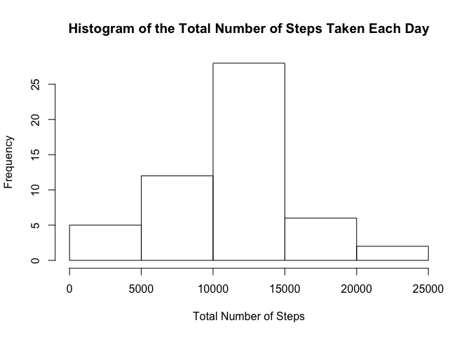

## Some Information
The variables included in the Activity.csv dataset are:

- steps: Number of steps taking in a 5-minute interval (missing values are coded as NA) 

- date: The date on which the measurement was taken in YYYY-MM-DD format

- interval: Identifier for the 5-minute interval in which measurement was taken

The dataset is stored in a comma-separated-value (CSV) file and there are a total of 17,568 observations in this dataset.

## Loading and preprocessing the data

```r
## Load the data (i.e. read.csv())
data <- read.csv('activity.csv')
cat("Data Dimensions: ", dim(data), "\n\n")
```

```
## Data Dimensions:  17568 3
```

```r
cat("Data Summary: \n", summary(data), "\n\n")
```

```
## Data Summary: 
##  Min.   :  0.00   1st Qu.:  0.00   Median :  0.00   Mean   : 37.38   3rd Qu.: 12.00   Max.   :806.00   NA's   :2304   2012-10-01:  288   2012-10-02:  288   2012-10-03:  288   2012-10-04:  288   2012-10-05:  288   2012-10-06:  288   (Other)   :15840   Min.   :   0.0   1st Qu.: 588.8   Median :1177.5   Mean   :1177.5   3rd Qu.:1766.2   Max.   :2355.0   NA
```

```r
head(data)
```

```
##   steps       date interval
## 1    NA 2012-10-01        0
## 2    NA 2012-10-01        5
## 3    NA 2012-10-01       10
## 4    NA 2012-10-01       15
## 5    NA 2012-10-01       20
## 6    NA 2012-10-01       25
```

```r
## Process/transform the data (if necessary) into a format suitable for your analysis
data_no_na <- na.omit(data)
```


## What is mean total number of steps taken per day?

```r
## For this part of the assignment, you can ignore the missing values in the dataset.

## 1. Make a histogram of the total number of steps taken each day
### Create table calculating total steps
total_steps <- aggregate(data_no_na$steps, by=list(data_no_na$date), sum)
### Rename columns (makes it easier to make histogram)
colnames(total_steps)[1:2] <- c("date", "total_steps")
### Create histogram
hist(total_steps$total_steps, main ="Histogram of the Total Number of Steps Taken Each Day", xlab = "Total Number of Steps")
```

<!-- -->

```r
## 2. Calculate and report the mean and median total number of steps taken per day
### Caluclate mean
mean <- mean(total_steps$total_steps)
### Calculate median
median <- median(total_steps$total_steps)
### Print results
cat("Mean: ", mean, "\n\n")
```

```
## Mean:  10766.19
```

```r
cat("Median:", median)
```

```
## Median: 10765
```

## What is the average daily activity pattern?

```r
## 1. Make a time series plot (i.e. type = "l") of the 5-minute interval (x-axis) and the average number 
##    of steps taken, averaged across all days (y-axis)

## 2. Which 5-minute interval, on average across all the days in the dataset, contains the maximum number of steps?
```

## Imputing missing values

```r
## Note that there are a number of days/intervals where there are missing values (coded as NA). 
## The presence of missing days may introduce bias into some calculations or summaries of the data.

## 1. Calculate and report the total number of missing values in the dataset (i.e. the total number of rows with NAs)

## 2. Devise a strategy for filling in all of the missing values in the dataset. The strategy does not need to be sophisticated. 
##    For example, you could use the mean/median for that day, or the mean for that 5-minute interval, etc.

## 3. Create a new dataset that is equal to the original dataset but with the missing data filled in.

## 4. Make a histogram of the total number of steps taken each day and Calculate and report the mean and median total number of steps 
##    taken per day. Do these values differ from the estimates from the first part of the assignment? 
##    What is the impact of imputing missing data on the estimates of the total daily number of steps?
```

## Are there differences in activity patterns between weekdays and weekends?

```r
## 1. Create a new factor variable in the dataset with two levels -- "weekday" and "weekend" indicating whether a given date 
##    is a weekday or weekend day.

## 2. Make a panel plot containing a time series plot (i.e. type = "l") of the 5-minute interval (x-axis) 
##    and the average number of steps taken, averaged across all weekday days or weekend days (y-axis). 
##    The plot should look something like the following, which was created using simulated data:
```
